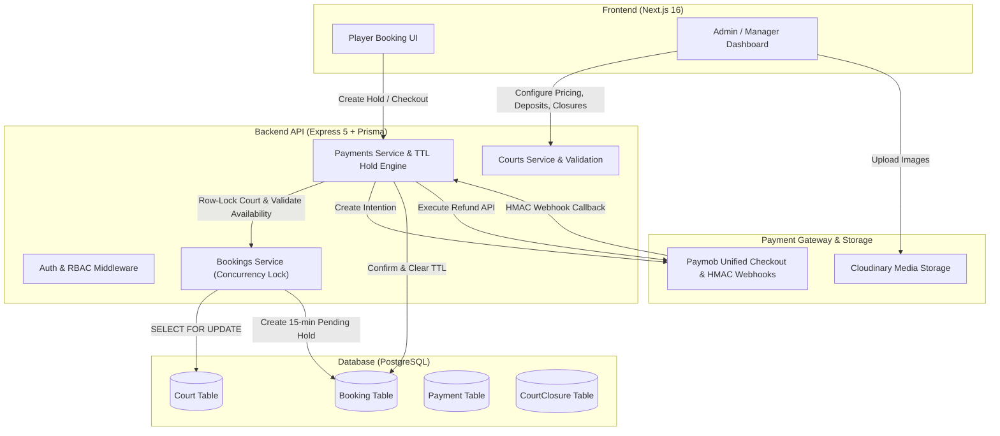

# Comprehensive Technical Architecture Audit Report

**Target System**: Mal3bk Booking & Payment Engine (`Mal3bak`)  
**Auditor**: Senior Technical Architect  
**Date**: August 18, 2026  
**Audit Scope**: Admin Capabilities (Pricing, Availability, Media, Discounts, Refunds), Temporary Reservation Engine (15-min TTL Hold), Concurrency/State Machines, and Dashboard/Notifications.

---

## Executive Summary & System Flow



---

## Part 1: Feature-by-Feature Breakdown

### 1. Pricing & Deposit Management

* **Status**: **Fully Implemented**
* **Current Workflow & Architecture**:
  * **Database Models**: 
    * `Court` (`prisma/schema.prisma`): `peakPrice`, `offPeakPrice`, `peakStartTime` (default `"18:00"`), `peakEndTime` (default `"06:00"`), `allowOnlinePayment` (Boolean), `paymentPolicy` (Enum: `full`, `percentage`, `fixed`), `depositValue` (Decimal).
    * `Booking` (`prisma/schema.prisma`): `totalPrice` (Decimal, full court session fee), `amount` (Decimal, amount due/paid online).
  * **API Endpoints**:
    * `POST /api/v1/courts`, `PATCH /api/v1/courts/:courtId` (`courts.routes.js`).
  * **Deposit Configuration & Calculation**:
    * Deposits are configured **per-venue/court** (not a single global value).
    * Validated via `courts.validation.js`: `percentage` policy requires `0 < depositValue <= 100`; `fixed` requires `depositValue > 0`.
    * Calculated in `payments.service.js` (`calculateOnlinePaymentAmount`):
      $$\text{Amount}_{\text{full}} = \text{totalPrice}$$
      $$\text{Amount}_{\text{percentage}} = \frac{\text{totalPrice} \times \text{depositValue}}{100}$$
      $$\text{Amount}_{\text{fixed}} = \min(\text{totalPrice}, \text{depositValue})$$
  * **Dynamic Field Pricing Engine**:
    * Handled in `bookings.service.js` (`calculateBookingPricing`): calculates duration in full-hour intervals, checks each 1-hour increment against `isPeakHour(slotTime, peakStartTime, peakEndTime)` (which seamlessly supports overnight spans like 18:00 to 06:00), and dynamically sums peak vs off-peak rates.
  * **Data Immutability**:
    * When a booking is created, `totalPrice` and `amount` are written immutably to the `Booking` and `Payment` records. Future edits to the court price or deposit rules only affect newly created sessions; historical bookings and existing pending sessions remain untouched.
* **Limitations / Vulnerabilities**:
  * Pricing rules support time-of-day peak/off-peak windows per court, but there are no day-of-week multipliers (e.g., custom weekend rates vs weekday rates).
* **Required Changes for Production**:
  * If weekend-specific or seasonal pricing is required in the future, add a `pricingRules` JSON column or related `CourtSpecialPricing` table with day-of-week criteria.

---

### 2. Availability & Time-Slot Management

* **Status**: **Fully Implemented**
* **Current Workflow & Architecture**:
  * **Database Models**:
    * `Court`: `openTime`, `closeTime`, `useOpeningDayForOvernightBookings` (Boolean).
    * `CourtClosure` (`prisma/schema.prisma`): `courtId`, `startDate` (DateTime), `endDate` (DateTime), `reason` (String).
  * **API Endpoints**:
    * `GET /api/v1/courts/:courtId/availability?date=YYYY-MM-DD`
    * `GET /api/v1/courts/:courtId/closures`, `POST /api/v1/courts/:courtId/closures`, `PATCH /api/v1/courts/closures/:closureId`, `DELETE /api/v1/courts/closures/:closureId`
  * **Availability Pipeline**:
    1. Admin creates or edits a time closure/maintenance block via `admin-courts-page.tsx` or updates court hours.
    2. When a player requests availability, `courts.service.js` generates all valid operating hours slots, filtering out:
       - Past slots.
       - Intersecting `CourtClosure` maintenance ranges.
       - Confirmed/completed bookings.
       - Active pending reservation holds (`status === "pending"` and `expiresAt > now`).
    3. User-facing slot grid reflects updated availability in real time via SWR / API polling.
  * **Booking Validation**:
    * `ensureCourtAvailable` (`bookings.service.js`) runs inside a database transaction, acquiring a PostgreSQL row lock (`SELECT 1 FROM "Court" WHERE id = $1 FOR UPDATE`). It verifies operating hours, bounds checking, active closures, and overlap formula:
      $$\text{Overlap} = (\text{Req}_{\text{start}} < \text{Existing}_{\text{end}}) \land (\text{Existing}_{\text{start}} < \text{Req}_{\text{end}})$$
* **Limitations / Vulnerabilities**:
  * Slots are constrained to 60-minute increments on the hour. 30-minute, 90-minute, or custom arbitrary slot lengths are not currently enabled in the validation layer.
* **Required Changes for Production**:
  * Production ready for 60-minute standard bookings. If variable slot durations (e.g., 90-minute Padel matches) are needed, allow `slotDuration` (e.g. 60/90/120) in `Court` settings.

---

### 3. Media Management (Field Images)

* **Status**: **Fully Implemented**
* **Current Workflow & Architecture**:
  * **Storage Mechanism**: Cloudinary Cloud CDN storage via stream upload (`uploads.routes.js`).
  * **API Endpoints**:
    * `POST /api/v1/uploads/images` (Multer multipart upload, max 10 files per request, 5MB limit, JPEG/PNG/WebP).
  * **Database Storage**: Stored as an array of secure URLs: `Court.images String[] @default([])`.
  * **Admin UI Capabilities** (`admin-courts-page.tsx`):
    * **Upload**: Drag-and-drop / file selector with upload progress.
    * **Set Cover / Primary**: One-click action that places the selected image at index 0 (`images[0]`).
    * **Reorder**: Left/Right swap controls to reorder images.
    * **Delete**: Removes single image from the court's list.
* **Limitations / Vulnerabilities**:
  * When an image is removed from a court in the admin dashboard, the reference is deleted from PostgreSQL, but the orphan asset is not destroyed from Cloudinary via `cloudinary.uploader.destroy()`.
* **Required Changes for Production**:
  * Implement an asynchronous Cloudinary cleanup hook when court images are deleted or replaced to optimize cloud storage usage.

---

### 4. Discount & Promotion Workflow

* **Status**: **Partially Implemented**
* **Current Workflow & Architecture**:
  * **Database Model**: `Booking.discountType` (`String?`), `Booking.discountValue` (`Decimal?`).
  * **Implemented Workflow**:
    * **Manager / Admin Manual Discounts**: Implemented in `new-booking-dialog.tsx` and `bookings.service.js`.
    * When an admin/manager creates a walk-in or manual booking, they can apply a `percentage` (0–100%) or `fixed` (0 to full price) discount.
    * **Calculation & Immutability**: Discount is calculated and deducted from `pricing.totalPrice` to produce `finalPrice`. The applied `discountType` and `discountValue` are stored immutably directly on the `Booking` record.
  * **Missing Workflow**:
    * There is **no public coupon/promo code engine** (no `Coupon` or `DiscountCode` database table).
    * Players cannot type promotional voucher codes during public checkout.
    * There are no automated campaign rules (e.g., promo codes valid between dates, usage count caps, minimum booking spend thresholds, or specific user tiers).
* **Limitations / Vulnerabilities**:
  * Manual discounts are available only to managers/admins creating reservations directly.
* **Required Changes for Production**:
  * To support marketing promo codes, create a `Coupon` table (`code`, `discountType`, `discountValue`, `expiresAt`, `maxUses`, `usedCount`, `minAmount`, `courtId?`), add a `POST /api/v1/coupons/validate` endpoint, and integrate the coupon input into the checkout dialog.

---

### 5. Refund Lifecycle

* **Status**: **Fully Implemented**
* **Current Workflow & Architecture**:
  * **Integration**: Fully integrated with **Paymob's Void/Refund API** (`paymob.service.js` `POST /api/acceptance/void_refund/refund`).
  * **Workflows Supported**:
    1. **Automated 24h Player Cancellation Refund** (`bookings.service.js`):
       - If a player cancels $\ge 24$ hours before start time, the backend automatically triggers `refundTransaction()` on Paymob.
       - Sets `Payment.status = "refunded"` and `Booking.paymentStatus = "refunded"`.
       - If $< 24$ hours (and $\ge 2$ hours), the booking is cancelled without a refund per venue policy.
       - If $< 2$ hours, cancellation is rejected with `400 Bad Request`.
    2. **Manager / Admin Manual Refund Action** (`payments.service.js`):
       - Endpoint: `POST /api/v1/payments/refund` with `bookingId` or `paymentId`.
       - RBAC Protected: Verified that caller is an Admin or the Manager who owns the venue.
       - Invokes Paymob Refund API, records `rawCallbackData`, and transitions booking to `cancelled` / `refunded`.
    3. **Paymob Dashboard Portal Webhook Sync** (`payments.service.js`):
       - If an admin refunds a transaction directly inside Paymob's merchant portal, Paymob dispatches an HMAC-verified webhook (`obj.is_refunded === true`), automatically syncing the database state.
  * **Availability on Refund**:
    - When a booking is refunded, its status becomes `cancelled`. It is immediately freed from `ensureCourtAvailable` overlap checks and becomes open for booking.
* **Limitations / Vulnerabilities**:
  * Currently, manual refunds default to the full paid amount. Partial custom refund amounts are supported in `refundPaymentService`, but the manager UI currently only triggers full refunds.
* **Required Changes for Production**:
  * Add an optional "Custom Refund Amount" input field to the manager refund confirmation dialog.

---

### 6. Temporary Booking Reservation (The 15-Minute Hold/Lock)

* **Status**: **Fully Implemented**
* **Current Workflow & Architecture**:
  * **Hold Creation**:
    * When a player initiates checkout (`payments.service.js`), a database transaction acquires a court row lock, verifies availability, and creates a `Booking` record:
      ```javascript
      status: "pending",
      paymentStatus: "pending",
      expiresAt: new Date(Date.now() + 15 * 60 * 1000) // 15-minute authoritative hold
      ```
  * **Availability Blocking**:
    * In `bookings.service.js`, both public availability queries and booking attempts treat pending bookings with `expiresAt > now()` as active conflicts. Other players cannot select or book this slot.
  * **Expiration Engine (Backend Authoritative)**:
    * **Active Database Guard**: `ensureCourtAvailable` checks `expiresAt: { gt: new Date() }`. If 15 minutes elapse, subsequent queries immediately treat the hold as expired without waiting for background cleanup.
    * **Background Sweep Worker**: In `server.js` and `bookings.service.js` (`expireStaleBookingHoldsService`), a recurring timer runs every 60 seconds sweeping expired pending holds and updating them to `status: "cancelled"`, `paymentStatus: "failed"`.
    * **Persistence**: The expiration time is stored in PostgreSQL as a timestamp column (`expiresAt`), making it completely resilient to server restarts.
  * **Success & Release Transition**:
    * If payment succeeds: Paymob webhook sets `status: "confirmed"`, `paymentStatus: "paid"`, and clears `expiresAt: null`.
    * If payment fails/expires: The slot is released back to the pool with zero charge to the player.
* **Limitations / Vulnerabilities**:
  * In a multi-instance / clustered Node environment, multiple servers would each run their own `setInterval` sweep. While `updateMany` is safe and idempotent, a distributed scheduler or Redis worker is cleaner for massive scale.
* **Required Changes for Production**:
  * Current implementation is fully operational and safe. For high-scale clustered deployments, wrap the hold cleaner in a Redis distributed lock or use BullMQ / pg-boss.

---

### 7. Concurrency, Race Conditions, & State Machines

* **Status**: **Fully Implemented**
* **Current Workflow & Architecture**:
  * **Concurrency Protection**:
    * Implemented via explicit database row locking in `bookings.service.js`:
      ```sql
      SELECT 1 FROM "Court" WHERE id = $courtId FOR UPDATE
      ```
    * If two players click "Pay" at the exact same millisecond for the same court slot, the second transaction is queued at the database level. Once the first transaction commits the hold, the second transaction sees the conflict and returns HTTP `409 Conflict` ("Selected time is no longer available").
  * **Webhook vs Expiration Race Condition**:
    * If a player completes payment at minute 14:59 and the webhook arrives at the exact moment the sweep worker runs:
      - The webhook handler (`payments.service.js`) executes inside a transaction.
      - Upon verifying HMAC SHA-512 and successful settlement, it overrides `status` to `confirmed` and `paymentStatus` to `paid`.
      - Webhook processing is idempotent: duplicate callbacks are rejected using `paymobTransactionId` unique index.
  * **State Machine Mapping**:
    * **Booking Lifecycle**:
      $$\text{AVAILABLE} \longrightarrow \text{pending (Hold + TTL)} \longrightarrow \begin{cases} \xrightarrow{\text{Webhook / Paid}} \text{confirmed} \xrightarrow{\text{Check-in}} \text{completed} \\ \xrightarrow{\text{Timeout / Fail}} \text{cancelled} \longrightarrow \text{AVAILABLE} \end{cases}$$
    * **Refund Lifecycle**:
      $$\text{confirmed (paid)} \longrightarrow \xrightarrow{\text{Refund Trigger}} \text{cancelled (refunded)} \longrightarrow \text{AVAILABLE}$$
* **Limitations / Vulnerabilities**:
  * None identified. Row locking and HMAC idempotency provide strong consistency guarantees.

---

### 8. Notifications & Admin Dashboard

* **Status**: **Fully Implemented**
* **Current Workflow & Architecture**:
  * **Notification System**:
    * In-app and Web Push notification pipeline with multi-channel delivery tracking (`prisma/schema.prisma`).
    * Notification events active for:
      - Booking Confirmation (`buildBookingCreatedNotifications`)
      - Cancellation & Automated Refund (`buildBookingCancelledNotifications`)
      - Check-in Confirmation (`buildBookingCheckedInNotifications`)
      - Status Updates & Rescheduling
  * **Admin Dashboard UI Mapping**:
    * `admin-courts-page.tsx`: Full court CRUD, pricing (peak/off-peak), deposit policies (Full/Percentage/Fixed), Cloudinary media management, maintenance closures.
    * `manager-bookings-page.tsx`: Booking management, manual bookings with percentage/fixed discounts, live check-in, Paymob refund triggers with confirmation dialog.
    * `revenue-report-page.tsx`: Complete revenue analytics, filtering by Paymob online transactions, venue walk-ins, and refunded payments.
* **Limitations / Vulnerabilities**:
  * When a 15-minute temporary reservation expires, no in-app notification is pushed to the player (the user is informed via the frontend checkout modal countdown timer).
* **Required Changes for Production**:
  * Optionally trigger a notification when a checkout session expires if the user has navigated away from the booking modal.

---

## Part 2: Executive Assessment

| Audit Question | Verdict | Key Architecture Reference |
| :--- | :---: | :--- |
| **Can the admin control deposit prices?** | **YES** | Per-court policy (`full`, `percentage`, `fixed`) and `depositValue` in `Court` model & admin UI. |
| **Can the admin control dynamic field pricing?** | **YES** | Base `offPeakPrice`, `peakPrice`, and customizable peak windows (`peakStartTime`/`peakEndTime`). |
| **Can the admin manage field booking times?** | **YES** | Configurable operating hours (`openTime`/`closeTime`) and `CourtClosure` maintenance intervals. |
| **Can the admin manage field images?** | **YES** | Cloudinary CDN stream upload, image reordering, primary cover selection, and deletion in admin UI. |
| **Can the admin create and manage discounts?** | **PARTIAL** | **YES** for Manual Booking Discounts (percentage & fixed). **NO** for public player coupon code campaigns. |
| **Is there a full refund API integration workflow?** | **YES** | Live Paymob Refund API integration (`POST /api/acceptance/void_refund/refund`) + automated 24h engine. |
| **Is the 10-minute/15-minute temporary reservation active?** | **YES** | 15-minute hold created with `status: pending`, `expiresAt: Date`, blocking public slot availability. |
| **Does the backend safely and automatically release expired reservations?** | **YES** | Authoritative database expiration query + 60s background sweep worker (`expireStaleBookingHoldsService`). |
| **Are concurrency and payment race conditions fully mitigated?** | **YES** | PostgreSQL row locking (`SELECT FOR UPDATE`), HMAC SHA-512 verification, and transaction deduplication. |
| **Are notifications for expiration and refunds active?** | **PARTIAL** | **YES** for refund, cancellation, and confirmation alerts. **NO** for silent background hold expiration. |
